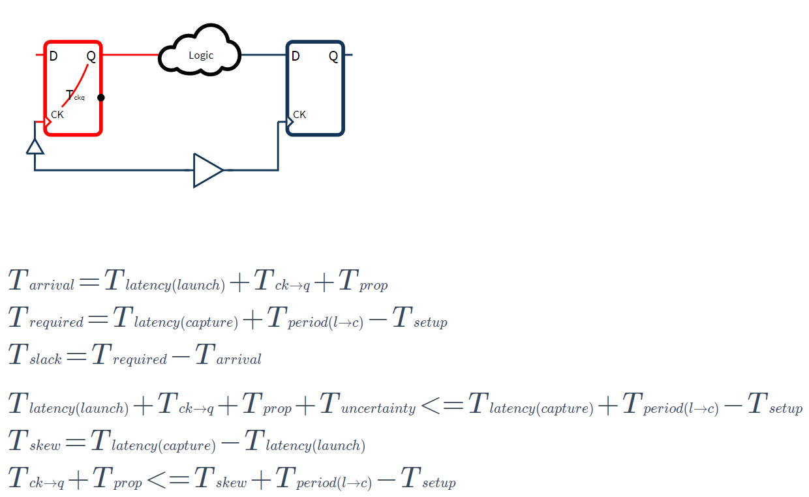

# icsvg

Use snapsvg to show the IC components

## Snapshort

## Execution

<svg id="svg"></svg>

$\Huge T\huge \scriptscriptstyle arrive \Huge = T\huge \scriptscriptstyle latency(launch) \Huge + T\huge \scriptscriptstyle ck\to q \Huge + T \huge \scriptscriptstyle prop \Huge + T \huge \scriptscriptstyle setup \newline \Huge T\huge \scriptscriptstyle require \Huge = T\huge \scriptscriptstyle latency(capture) \Huge + T \huge \scriptscriptstyle period(l\to c)$

$\Huge T\huge \scriptscriptstyle latency(launch) \Huge + T\huge \scriptscriptstyle ck\to q \Huge + T \huge \scriptscriptstyle prop \Huge + T \huge \scriptscriptstyle setup \Huge <= T\huge \scriptscriptstyle latency(capture) \Huge + T \huge \scriptscriptstyle period(l\to c) \newline \Huge T\huge \scriptscriptstyle skew \Huge = T\huge \scriptscriptstyle latency(capture) \Huge - T\huge \scriptscriptstyle latency(launch)\newline \Huge T\huge \scriptscriptstyle ck\to q \Huge + T \huge \scriptscriptstyle prop \Huge + T \huge \scriptscriptstyle setup \Huge <= T\huge \scriptscriptstyle skew \Huge + T \huge \scriptscriptstyle period(l\to c)$

> [!Note]
> $\Large T \large \scriptscriptstyle period$ means the period from launch clock edge to capture edge.
> 
> That may be one cycle of clock, half or 60% of clock cycle based on duty cycle.
